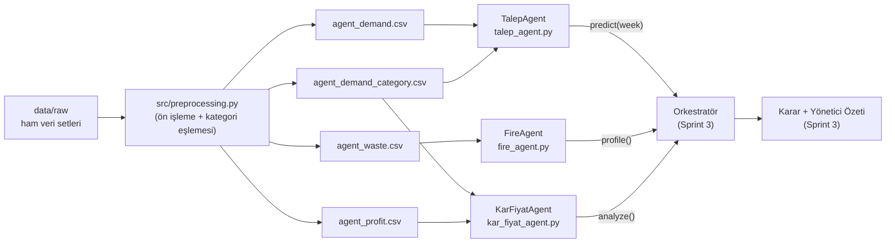

# **Takım İsmi**

**The Parsimonia**

# **Takım Logosu**


## Takım Elemanları

| | İsim | Ünvan | Sosyal Medya |
|---|---|---|---|
|  | Beyza ATA | Product Owner | [LinkedIn](https://www.linkedin.com/in/beyza-ata-50a2b3317/) |
|  | Pelin ATAMAN | Scrum Master | [LinkedIn](https://www.linkedin.com/in/pelin-ataman) |
|  | Furkan BİTİK | Developer | [LinkedIn](https://www.linkedin.com/in/furkanbitik/) |

## Ürün İsmi

**WasteZero AI**

## Ürün Logosu


## Ürün Açıklaması

- **WasteZero AI**, restoranlar için akıllı menü, talep ve israf karar destek sistemidir. Restoranların geçmiş satış, üretim, fiyat, maliyet ve kampanya verilerini analiz ederek ürün bazlı talep tahmini yapar, fazla üretimden kaynaklanan fire/israf riskini hesaplar ve kârlılığı koruyacak şekilde günlük üretim ve menü kararlarına aksiyon önerileri sunar.

- Sistem, tek bir model yerine her biri kendi gerçek verisiyle çalışan **uzman agent'lardan** oluşur. Agent'lar çıktılarını ortak bir dil olan **ürün kategorisi** (çorba, ana yemek, salata, tatlı, içecek) üzerinden paylaşır. Bir **orkestratör** (Sprint 3), agent çıktılarını birleştirip çelişkileri (satış kaçırma riski ile fire riski arasındaki denge) değerlendirerek son kararı ve yönetici özetini üretecektir.

| Agent | Görevi | Durum |
|---|---|---|
| Talep Agent'ı | Kategori bazlı satış/talep tahmini | ✅ Uygulandı (`src/talep_agent.py`) |
| Fire/İsraf Agent'ı | Ürün bazlı israf riski profili | ✅ Uygulandı (`src/fire_agent.py`) |
| Kâr/Fiyat Agent'ı | Fiyat, maliyet ve kârlılık analizi | ✅ Uygulandı (`src/kar_fiyat_agent.py`) |
| Orkestratör | Agent çıktılarını birleştirir, karar ve yönetici özeti üretir | 🔜 Sprint 3 |

## Ürün Özellikleri

- Gerçek şirket verisiyle eğitilmiş, kategori bazlı talep tahmini
- Ürün bazlı fire/israf risk profili (kompozit risk indeksi ve sürücü etkenler)
- Fiyat, maliyet ve kârlılık analizi (agent_profit.csv + marj bazlı yedek hesaplama)
- Agent bazlı, modüler mimari (her agent bağımsız geliştirilebilir ve test edilebilir)
- Ortak kategori dili ve ortak sinyal sözleşmesi (`yuksek` / `normal` / `dusuk` / `veri_yok`) sayesinde agent çıktıları doğrudan karşılaştırılabilir
- Orkestratör aracılığıyla tek bir karar çıktısı ve AI destekli günlük yönetici özeti (Sprint 3)
- Otomatik testlerle korunan, tekrarlanabilir kod tabanı (30 test)

## Hedef Kitle

- Restoran işletmecileri ve zincir restoran yöneticileri
- Yemekhane / toplu yemek üretim tesisleri
- Gıda israfını azaltmayı ve kârlılığını artırmayı hedefleyen tüm yiyecek-içecek işletmeleri

## Mimari

WasteZero AI, tek bir uçtan-uca modelden değil, her biri kendi veri kaynağıyla çalışan **üç bağımsız uzman agent**'tan oluşur. Agent'lar birbirinden habersiz çalışabilir çünkü hepsi aynı ortak dili konuşur:

- **Ortak kategori dili**: tüm agent çıktıları 5 ürün kategorisi üzerinden ifade edilir — `corba`, `ana_yemek`, `salata`, `tatli`, `icecek` (bkz. `src/sabitler.py`). Ham veri setlerindeki 14+ farklı ürün/yemek etiketi, ön işleme aşamasında bu 5 kategoriye eşlenir.
- **Ortak sinyal sözleşmesi**: her agent, kategori başına `"yuksek" | "normal" | "dusuk" | "veri_yok"` değerlerinden birini üretir. Bu sayede orkestratör, farklı kaynaklardan gelen üç agent çıktısını doğrudan karşılaştırıp çelişkileri çözebilir (örn. yüksek talep + yüksek israf riski).
- **Orkestratör (Sprint 3)**: üç agent'ın kategori bazlı sinyallerini ve sayısal profillerini birleştirerek nihai üretim/menü kararını ve yönetici özetini üretecek katman.



## Agent Çıktı Sözleşmeleri

Her agent, kendi ham verisinden kategori bazlı bir profil çıkarır ve bunu ortak sinyal sözleşmesiyle birlikte bir Python sözlüğü (JSON uyumlu) olarak döner. Aşağıdaki örnekler, her agent'ın `src/` altındaki demo komutuyla üretilen gerçek çıktı biçimini yansıtır.

### Talep Agent'ı (`src/talep_agent.py`)

Genpact Food Demand veri setinden (456.548 satır, 145 hafta) ürün seviyesinde eğitilip kategoriye toplanan bir `HistGradientBoostingRegressor` (Poisson kaybı) kullanır. Model, zamana göre ayrılmış eğitim/doğrulama/test dilimleriyle seçilmiştir; kategori bazında ortalama mutlak yüzde hatası (MAPE) %8.27'den %7.50'ye düşürülmüştür. `predict(week)` çağrısı, ilgili hafta için kategori bazlı tahmin ve talep sinyali döner.

```json
{
  "week": 140,
  "in_sample": false,
  "by_category": {
    "ana_yemek": 379028, "corba": 10335, "icecek": 242680,
    "salata": 113416, "tatli": 13429
  },
  "signal": {
    "ana_yemek": "dusuk", "corba": "yuksek", "icecek": "dusuk",
    "salata": "yuksek", "tatli": "normal"
  }
}
```

### Fire/İsraf Agent'ı (`src/fire_agent.py`)

`data/processed/agent_waste.csv` (1.618 israf olayı) üzerinden kategori başına deterministik bir kompozit risk indeksi hesaplar: `0.6 × (kategori ortalama waste_ratio / genel ortalama) + 0.4 × (kategori yüksek-israf kuyruk payı / genel kuyruk payı)` (kuyruk = 90. yüzdelik üstü). Sinyal eşikleri 1.05 / 0.95'tir; ayrıca her kategori için en yüksek israfa yol açan fiyat seviyesi ve hazırlama yöntemi "sürücü" olarak raporlanır. `corba` kategorisi bu veri setinde hiç örnek içermediği için `"veri_yok"` döner.

```json
{
  "source": "agent_waste",
  "global_mean_waste_ratio": 0.0687,
  "by_category": {
    "corba": null, "ana_yemek": 0.0684, "salata": 0.0676,
    "tatli": 0.0692, "icecek": 0.0684
  },
  "risk_index": {
    "corba": null, "ana_yemek": 1.0628, "salata": 0.8441,
    "tatli": 1.0348, "icecek": 0.9522
  },
  "signal": {
    "corba": "veri_yok", "ana_yemek": "yuksek", "salata": "dusuk",
    "tatli": "normal", "icecek": "normal"
  },
  "drivers": {
    "corba": null,
    "ana_yemek": {"pricing_level": "High", "prep_method": "Sit-down Dinner"},
    "...": "..."
  }
}
```

### Kâr/Fiyat Agent'ı (`src/kar_fiyat_agent.py`)

Öncelikli kaynak `data/processed/agent_profit.csv`'deki `profitability_score` (1/2/3) değeridir; `(ortalama - 1) / 2` ile [0, 1] aralığına normalize edilir. Kâr verisinde örneği olmayan kategoriler (örn. `corba`) için `agent_demand_category.csv`'den marj oranına (`(satış fiyatı - girdi maliyeti) / satış fiyatı`) dayalı bir **yedek hesaplama** devreye girer. Sinyal eşikleri 0.60 / 0.40'tır.

```json
{
  "source": "agent_profit+demand_category",
  "by_category": {
    "corba": 0.7909, "ana_yemek": 0.7457, "salata": 0.7154,
    "tatli": 0.7253, "icecek": 0.3569
  },
  "signal": {
    "corba": "yuksek", "ana_yemek": "yuksek", "salata": "yuksek",
    "tatli": "yuksek", "icecek": "dusuk"
  },
  "drivers": {
    "corba": {"avg_price": null, "margin_ratio": 0.7909, "high_share": null,
              "source": "demand_fallback", "low_n": true},
    "ana_yemek": {"avg_price": 17.6602, "margin_ratio": 0.7449, "high_share": 0.5332,
                  "source": "profit", "low_n": false},
    "...": "..."
  }
}
```

## Veri Pipeline'ı

`src/preprocessing.py`, ham veriden agent'ların tükettiği işlenmiş CSV'lere giden **tekrarlanabilir** dönüşüm hattıdır:

- **Girdi**: `data/raw/` altındaki 6 ham veri seti (Genpact talep verisi + `meal_info.csv`, israf verisi, kârlılık verisi, `restaurant_sales_data.csv`).
- **Dönüşüm**: eksik değer/tip temizliği, 14 → 5 kategori eşlemesi (`map_to_category`, sayısal kod eşlemesi + diğer veri setleri için anahtar kelime eşlemesi), tarih/hafta alanlarının normalize edilmesi.
- **Çıktı**: 4 işlenmiş CSV — `agent_demand.csv` (456.548 × 13), `agent_demand_category.csv` (10.000 × 15), `agent_waste.csv` (1.618 × 14), `agent_profit.csv` (973 × 9).
- **Tekrarlanabilirlik**: `python -m src.preprocessing` komutu, `data/processed/` altındaki mevcut dosyalarla **bayt bazında birebir aynı** çıktıyı üretecek şekilde doğrulanmıştır.

Kullanılan veri setleri, kaynakları ve hangi agent'a ait oldukları [`data/DATA_SOURCES.md`](data/DATA_SOURCES.md) dosyasında listelenmiştir.

## Product Backlog

- Agent bazlı sisteme uygun gerçek veri setlerinin bulunması ve hazırlanması ✅
- Keşifsel veri analizi (EDA) ✅
- Talep tahmin agent'ının eğitilmesi ✅
- Fire/israf risk agent'ının kurulması ✅
- Kâr/fiyat agent'ının kurulması ✅
- Agent'lar arası orkestrasyon ve karar katmanı (Sprint 3)
- Yönetici paneli / arayüz (Sprint 3)
- AI destekli günlük yönetici özeti (Sprint 3)

## Repo Yapısı

```
BootcampYZTA_grup_112/
├── README.md                          # Bu dosya
├── requirements.txt                   # Python bağımlılıkları (pandas, numpy, scikit-learn, joblib, ...)
├── docs/
│   └── assets/                        # Görseller (takım logosu, üye fotoğrafları, Trello board)
├── data/
│   ├── raw/                           # İndirilen ham veri setleri (6 CSV)
│   ├── processed/                     # Agent bazlı işlenmiş veri (4 CSV)
│   └── DATA_SOURCES.md                # Agent–veri seti eşleştirmesi ve linkler
├── notebooks/
│   ├── 01_preprocessing_eda.ipynb     # Ön işleme + keşifsel veri analizi
│   ├── talep_agent.ipynb              # Talep Agent'ı araştırma kaydı
│   └── Kar_Fiyat_Agent.ipynb          # Kâr/Fiyat Agent'ı araştırma kaydı
├── src/
│   ├── __init__.py
│   ├── sabitler.py                    # Ortak kategori listesi ve sinyal sözleşmesi
│   ├── preprocessing.py               # Ham veriden işlenmiş veriyi üreten pipeline
│   ├── talep_agent.py                 # Talep Agent modülü
│   ├── fire_agent.py                  # Fire/İsraf Agent modülü
│   └── kar_fiyat_agent.py             # Kâr/Fiyat Agent modülü
├── models/
│   └── talep_agent.joblib             # Eğitilmiş talep tahmin modeli (eksikse otomatik yeniden eğitilir)
└── tests/
    ├── test_talep_agent.py            # Talep Agent testleri (8)
    ├── test_fire_agent.py             # Fire/İsraf Agent testleri (8)
    ├── test_kar_fiyat_agent.py        # Kâr/Fiyat Agent testleri (8)
    └── test_preprocessing.py          # Pipeline testleri (6)
```

## Kurulum

```bash
pip install -r requirements.txt

python -m src.preprocessing        # ham veriden işlenmiş veriyi üret
python -m src.talep_agent          # talep demo (hafta 140 tahmini)
python -m src.fire_agent           # israf riski profili demo
python -m src.kar_fiyat_agent      # kârlılık profili demo

python tests/test_talep_agent.py   # her test dosyası tek başına çalışır (pytest gerektirmez)
```

## Testler

Toplam **30 otomatik test** (8 Talep Agent + 8 Fire/İsraf Agent + 8 Kâr/Fiyat Agent + 6 pipeline), hepsi geçiyor. Her test dosyası bağımsız çalışacak şekilde yazılmıştır ve `pytest` gerektirmez:

```bash
python tests/test_talep_agent.py
python tests/test_fire_agent.py
python tests/test_kar_fiyat_agent.py
python tests/test_preprocessing.py
```

Testler şunları kapsar:

- **Sözleşme testleri**: her agent çıktısının beklenen anahtarları, kategori listesini ve sinyal değerlerini (`yuksek`/`normal`/`dusuk`/`veri_yok`) içerdiğinin doğrulanması.
- **Regresyon pinleri**: bilinen girdiler için beklenen sayısal sonuçların (hafta 140 talep tahminleri, risk indeksleri, kârlılık skorları) sabit referans değerlerle karşılaştırılması — model veya veri sessizce bozulursa test yakalar.
- **Determinizm**: aynı girdiyle art arda çağrıların birebir aynı çıktıyı üretmesi.
- **Sağlamlık / uç durumlar**: veri setinde örneği olmayan kategoriler (`corba` için israf verisi), eksik ikincil veri dosyası (kârlılıkta profit-only mod), pipeline çıktılarının beklenen şema ve türetilmiş kolon doğruluğu.

---

# Sprint 1

- **Sprint Notları**: User Story'ler product backlog item'ları içinde detaylandırılmıştır. Sprint 1'in tüm Scrum çıktıları (backlog dağıtma mantığı, Daily Scrum notları, board güncellemeleri, Review ve Retrospective) aşağıda ayrıntılı olarak yer almaktadır.

- **Sprint içinde tamamlanması tahmin edilen puan**: 100 Puan

- **Puan tamamlama mantığı**: Proje boyunca tamamlanması gereken toplam 300 puanlık backlog bulunmaktadır. 3 sprint'e bölündüğünde her sprint'in 100 puandan oluşması kararlaştırıldı. İlk sprint'in kapsamı bilinçli olarak dar tutuldu: sağlam bir veri temeli ve keşifsel analiz olmadan modelleme, agent eğitimi ve karar katmanının anlamlı kurulması mümkün olmadığı için bu bileşenler sonraki sprint'lere bırakıldı.

- **Backlog düzeni ve Story seçimleri**: Görevler üç ilkeye göre dağıtılmıştır: **bağımlılık sırası** (EDA veriye bağımlı olduğu için önce veri araştırma ve temizleme planlandı), **yetkinlik ve ilgi alanı**, **iş yükü dengesi** (üç kişilik takımda Product Owner ve Scrum Master da aktif olarak geliştirmeye katıldı).

| ID | İş (User Story) | Atanan | Öncelik |
|---|---|---|---|
| US-01 | Agent bazlı sistem için uygun gerçek veri setlerinin araştırılması (talep, fire/israf, kâr/fiyat) | Beyza, Pelin, Furkan | Yüksek |
| US-02 | Seçilen veri setlerinin temizlenmesi ve ön işlenmesi (eksik değer, tip dönüşümü, tarih alanları) | Pelin, Beyza, Furkan | Yüksek |
| US-03 | GitHub repo yapısı, klasör düzeni, README ve veri dokümantasyonu | Pelin | Orta |
| US-04 | Keşifsel veri analizinin başlatılması (temel keşif ve ilk görselleştirmeler) | Furkan | Orta |

- **Daily Scrum**: Ekip üyelerinin eğitim ve iş sorumlulukları nedeniyle Daily Scrum, sprint boyunca haftada bir gün akşam saatlerinde online yapılmıştır (2 haftalık sprint'te toplam 2 toplantı). Her üye üç soruyu yanıtlamıştır: *Geçen haftadan bu yana ne yaptım? Önümüzdeki hafta ne yapacağım? Önümde engel var mı?*

- **Sprint board update**: Görevler To Do → In Progress → Done sütunlarında Trello üzerinden takip edilmiştir.


| Aşama | To Do | In Progress | Done |
|---|---|---|---|
| Sprint Başı | US-01, US-02, US-03, US-04 | — | — |
| Sprint Ortası | US-04 | US-02, US-03 | US-01 |
| Sprint Sonu | — | US-04 (devam ediyor) | US-01, US-02, US-03 |

- **Ürün Durumu**: Sprint 1 sonunda WasteZero AI'nın veri temeli hazırdır ve keşifsel analiz başlatılmıştır. Talep, fire/israf ve kâr/fiyat konularını kapsayan gerçek veri setleri seçilmiş; eksik değerler, tip dönüşümleri ve tarih alanları işlenerek veri temizlenmiş; veri kaynakları ve değişkenler belgelenmiş; repo altyapısı kurulmuş ve EDA'nın ilk görselleştirmeleri üretilmiştir.

- **Sprint Review**:
  - Sprint hedefi (agent bazlı sisteme uygun gerçek veri setlerini bulmak ve EDA'ya başlamak) karşılandı.
  - Veri araştırma (US-01), temizleme (US-02) ve dokümantasyon (US-03) tamamlandı; EDA (US-04) planlandığı gibi başlatıldı ve kalan kısmı Sprint 2'ye devredildi.
  - Demo'da seçilen veri setleri, temizlik adımları ve ilk keşifsel analiz grafikleri gösterildi.
  - Sprint Review katılımcıları: Beyza ATA, Pelin ATAMAN, Furkan BİTİK.

- **Sprint Retrospective**:
  - Sprint kapsamını dar ve gerçekçi tutmak doğru karardı; hedefe ulaşıldı. Haftalık akşam toplantıları üyelerin yoğunluğuna uygundu ve düzenli yapıldı.
  - İki kişi eksik başlandığı için zamansal olarak geri kalındı; haftada tek toplantı, hafta içi küçük soruların çözümünü zaman zaman yavaşlattı; farklı kaynaklardan gelen veri setlerini ortak yapıya oturtmak beklenenden fazla tartışma gerektirdi.
  - Sonraki sprint kararları: Backlog dağıtımı aktif üye sayısına göre sürekli güncellenecek; haftalık toplantıya ek olarak hafta içi engeller için kısa yazılı güncelleme akışı kurulacak; veri setlerinin ortak yapısı (kategori eşlemesi) Sprint 2'nin başında netleştirilecek.

---

# Sprint 2

- **Sprint Notları**: Sprint 2'nin hedefi EDA'nın tamamlanması ve agent geliştirmeye geçilmesiydi. Görevler agent bazında paylaştırıldı: **Talep Agent'ı → Beyza**, **Fire/İsraf Agent'ı → Furkan**, **Kâr/Fiyat Agent'ı → Pelin**. Talep Agent'ının teknik detayları `notebooks/talep_agent.ipynb` ve `src/talep_agent.py` içinde; özet aşağıdaki Ürün Durumu bölümündedir.

- **Sprint içinde tamamlanması tahmin edilen puan**: 100 Puan

- **Puan tamamlama mantığı**: Toplam 300 puanlık backlog'un ikinci 100 puanlık dilimi bu sprint'e ayrılmıştır. Backlog, oyuncu ihtiyacı yerine sistemin çekirdeğini besleyecek şekilde düzenlendi: önce ortak kategori dili netleştirildi, ardından her üye kendi agent'ını bu ortak dil üzerinden geliştirdi.

- **Backlog düzeni ve Story seçimleri**:

| ID | İş (User Story) | Atanan | Öncelik |
|---|---|---|---|
| US-05 | EDA'nın tamamlanması ve ortak kategori eşlemesinin (14 → 5) netleştirilmesi | Furkan, Beyza | Yüksek |
| US-06 | Talep Agent'ının geliştirilmesi ve eğitilmesi | Beyza | Yüksek |
| US-07 | Fire/İsraf Agent'ı için veri profili ve geliştirme | Furkan | Yüksek |
| US-08 | Kâr/Fiyat Agent'ı için veri profili ve geliştirme | Pelin | Yüksek |
| US-09 | Agent çıktı sözleşmesinin (JSON formatı) tanımlanması ve otomatik testler | Beyza | Orta |

- **Daily Scrum**: Sprint 1 retrospective kararı doğrultusunda haftalık akşam toplantılarına ek olarak, hafta içi engeller için kısa yazılı güncelleme akışı (WhatsApp) kullanılmıştır.

- **Sprint board update**: Sprint sonunda Trello panosunun güncel durumu:


- **Ürün Durumu**: Sprint 2 sonunda:
  - **Talep Agent'ı geliştirildi ve hazır durumda**: Genpact gerçek talep verisiyle (456.548 satır, 145 hafta) eğitilen agent, orkestratörün tek satırla çağırabileceği bir Python sınıfı (`src/talep_agent.py`) olarak teslim edildi ve **8/8 otomatik test** ile korunuyor. Temiz kurulum doğrulamasında agent kendini eğitip birebir aynı sonuçları üretti. Agent, orkestratör entegrasyonu için hazır beklemektedir.
  - Eğitimde zamana göre ayrım kullanıldı (eğitim: hafta 1–130, doğrulama/test ayrımı korunarak); model seçimi test kümesine bakılmadan ayrı bir doğrulama diliminde yapıldı. 7 farklı iyileştirme denemesi kaydedildi ve yalnızca doğrulamada kazananlar (Poisson kaybı + promosyon özellikleri) final modele alındı.
  - EDA'dan önemli bulgu: promosyon, satışı **~3 katına** çıkarıyor; çorba kategorisinde veri boyunca hiç e-posta promosyonu yapılmamış (yalnızca sınırlı sayıda anasayfa vitrini var).
  - **Değerlendirme yaklaşımı**: Agent'ların tekil performans karşılaştırması bu aşamada raporlanmamaktadır. Sistemin nihai değerlendirmesi, Sprint 3 sonunda orkestratör dahil tüm agent çıktılarıyla birlikte, modern tahmin metrikleri olan **WAPE** (Weighted Absolute Percentage Error) ve **RMSSE** (Root Mean Squared Scaled Error — M5 Forecasting yarışmasıyla standartlaşan metrik) üzerinden uçtan uca yapılacaktır.
  - **Fire/İsraf ve Kâr/Fiyat agent'ları da geliştirildi ve hazır durumda**: her ikisi de `src/` altında (`fire_agent.py`, `kar_fiyat_agent.py`) birer Python sınıfı olarak uygulandı, her biri **8/8 otomatik test** ile korunuyor ve kategori bazlı risk/kârlılık profillerini orkestratörün tüketebileceği ortak sözleşme (`yuksek/normal/dusuk/veri_yok`) üzerinden üretiyor.

- **Sprint Review**:
  - Talep Agent'ının uçtan uca çalıştığı, JSON çıktı sözleşmesinin (kategori bazlı tahmin + `yuksek/normal/dusuk` sinyali) orkestratör için hazır olduğu gösterildi.
  - Performans çıktıları ve karşılaştırmaların, sistem bütünüyle anlamlı olması için Sprint 3 sonunda tüm agent'lar ve orkestratörle birlikte raporlanmasına karar verildi.
  - Sprint Review katılımcıları: Beyza ATA, Pelin ATAMAN, Furkan BİTİK.

- **Sprint Retrospective**:
  - **Doküman ile kod çelişiyordu**: `DATA_SOURCES.md` Genpact veri setini işaret ediyordu ancak işlenmiş dosyada kategori bilgisi yoktu; eksik `meal_info.csv` bulunup eklendi. *Ders: koda başlamadan kaynak dokümanı doğrula.*
  - **İlk model tasarımı revize edildi**: kategori seviyesinde eğitilen ilk tasarım beklenen doğruluğu sağlayamadı; ürün seviyesinde eğitim + kategoriye toplama yaklaşımına geçildi. *Ders: model tasarımı erken aşamada doğrulama verisiyle sınanmalı.*
  - **Model seçimi test kümesiyle yapılmamalı**: kazanan hep doğrulama diliminde seçildi; mevsimsellik denemesi bunun neden şart olduğunu kanıtladı (doğrulamada kazanıp testte kaybetti).
  - Sprint 3 kararları: Orkestratör, `TalepAgent().predict(week)` çıktısını Fire ve Kâr agent'larının kategori profilleriyle birleştirecek; karar katmanı, arayüz ve AI destekli yönetici özeti geliştirilecek; **tüm sistemin uçtan uca değerlendirmesi (WAPE ve RMSSE metrikleriyle) ve çıktı karşılaştırmaları Sprint 3 sonunda raporlanacak**.

---
