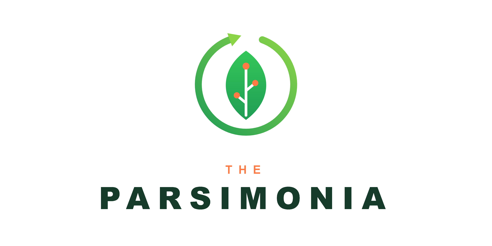
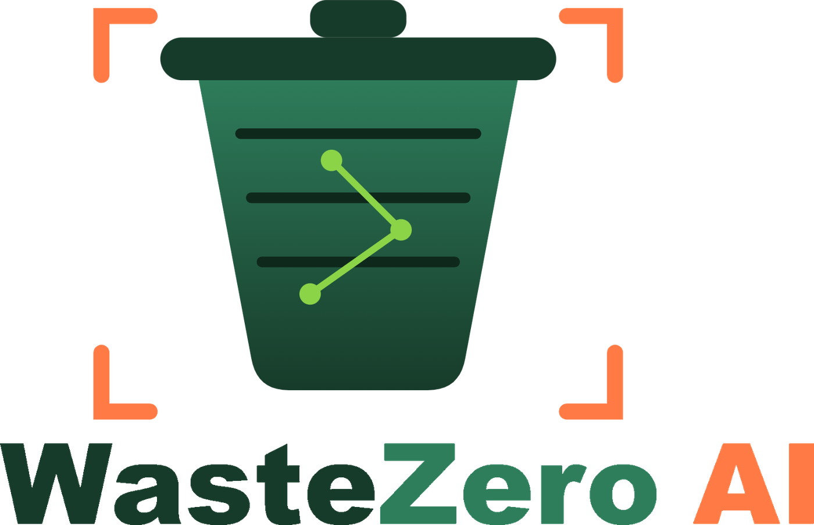
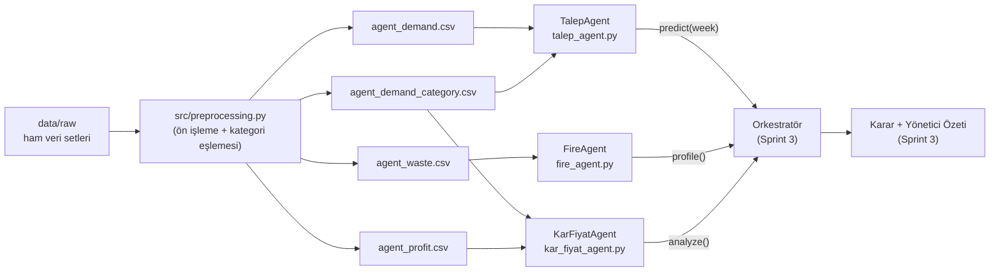
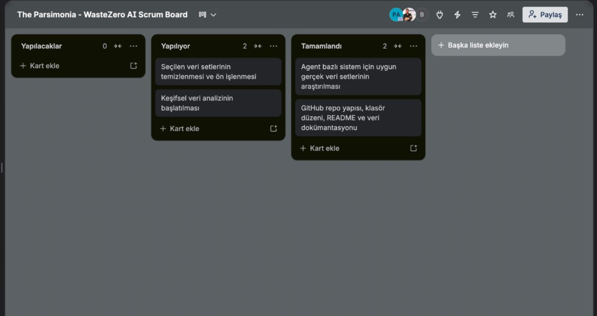
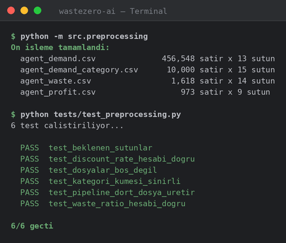
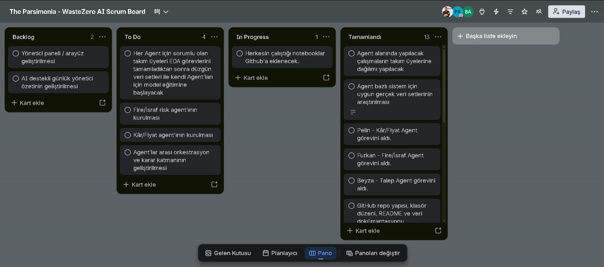
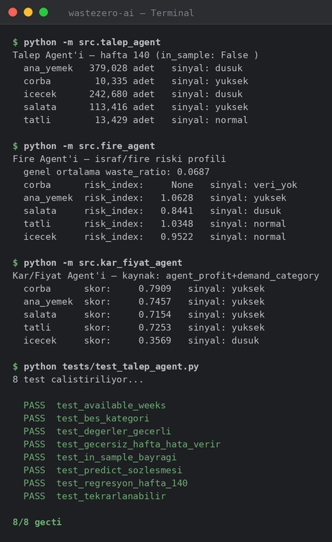

# The Parsimonia — WasteZero AI



## Takım

| | İsim | Scrum Rolü | Sosyal Medya |
|---|---|---|---|
|  | Beyza ATA | Product Owner | [LinkedIn](https://www.linkedin.com/in/beyza-ata-50a2b3317/) |
|  | Pelin ATAMAN | Scrum Master | [LinkedIn](https://www.linkedin.com/in/pelin-ataman) |
|  | Furkan BİTİK | Developer | [LinkedIn](https://www.linkedin.com/in/furkanbitik/) |

## Ürün



**WasteZero AI**, restoranlar için akıllı talep, israf ve kârlılık karar destek sistemidir. Geçmiş satış, üretim, fiyat ve maliyet verilerinden kategori bazlı talep tahmini yapar, fazla üretimden kaynaklanan fire riskini hesaplar ve kârlılığı koruyacak günlük üretim/menü kararları önerir. Hedef kitle: restoran ve zincir restoran yöneticileri, yemekhaneler ve israfını azaltmak isteyen tüm yiyecek-içecek işletmeleri.

Sistem, tek bir model yerine her biri kendi gerçek verisiyle çalışan **uzman agent'lardan** oluşur:

| Agent | Görevi | Durum |
|---|---|---|
| Talep Agent'ı | Kategori bazlı satış/talep tahmini | ✅ `src/talep_agent.py` |
| Fire/İsraf Agent'ı | Ürün bazlı israf riski profili | ✅ `src/fire_agent.py` |
| Kâr/Fiyat Agent'ı | Fiyat, maliyet ve kârlılık analizi | ✅ `src/kar_fiyat_agent.py` |
| Orkestratör | Agent çıktılarını birleştirir, karar ve yönetici özeti üretir | 🔜 Sprint 3 |

## Scrum Çerçevesi

Proje, Google Yapay Zeka ve Teknoloji Akademisi (YZTA) Bootcamp takvimine uygun olarak **3 sprint × 2 hafta** halinde Scrum ile yürütülmektedir.

- **Roller**: Product Owner (Beyza — backlog önceliklendirme, ürün vizyonu), Scrum Master (Pelin — süreç, engel çözme, board takibi), Developer (Furkan). Üç kişilik takımda PO ve SM de aktif geliştirme yapar.
- **Product Backlog**: toplam **300 puan**, her sprint'e 100 puan. Puanlama backlog düzenleme toplantısında birlikte yapıldı; dağıtımda bağımlılık sırası (önce veri, sonra model, sonra orkestrasyon), yetkinlik ve iş yükü dengesi gözetildi.
- **Sprint Planning**: her sprint başında hedef ve User Story seçimi; **Daily Scrum**: haftalık online akşam toplantısı + hafta içi WhatsApp üzerinden yazılı asenkron güncellemeler (aşağıdaki notlar bu akıştan derlenmiştir); **Sprint Review** ve **Retrospective**: her sprint sonunda tüm ekiple.
- **Board**: Trello (To Do → In Progress → Done).

**Backlog durumu**: veri setleri ✅ · EDA ✅ · Talep Agent'ı ✅ · Fire/İsraf Agent'ı ✅ · Kâr/Fiyat Agent'ı ✅ · Orkestratör + arayüz + AI yönetici özeti + uçtan uca değerlendirme (WAPE/RMSSE) → Sprint 3.

## Mimari

Agent'lar birbirinden bağımsızdır çünkü hepsi aynı ortak dili konuşur:

- **Ortak kategori dili**: tüm çıktılar 5 kategori üzerinden ifade edilir — `corba`, `ana_yemek`, `salata`, `tatli`, `icecek` (`src/sabitler.py`). Ham verideki 14+ ürün etiketi ön işlemede bu 5 kategoriye eşlenir.
- **Ortak sinyal sözleşmesi**: her agent kategori başına `"yuksek" | "normal" | "dusuk" | "veri_yok"` üretir; orkestratör bu sayede farklı kaynaklı çıktıları doğrudan karşılaştırıp çelişkileri (ör. yüksek talep + yüksek israf riski) çözebilir.



Her agent, JSON uyumlu bir Python sözlüğü döner. Örnek — `TalepAgent().predict(140)`:

```json
{
  "week": 140,
  "in_sample": false,
  "by_category": {"ana_yemek": 379028, "corba": 10335, "icecek": 242680,
                  "salata": 113416, "tatli": 13429},
  "signal": {"ana_yemek": "dusuk", "corba": "yuksek", "icecek": "dusuk",
             "salata": "yuksek", "tatli": "normal"}
}
```

Fire Agent'ı aynı sözleşmeyle kategori başına `risk_index` ve israf "sürücülerini" (`pricing_level`, `prep_method`), Kâr/Fiyat Agent'ı ise [0, 1] aralığında kârlılık skoru ve marj/fiyat sürücülerini döner. Kullanılan veri setleri ve linkleri: [`data/DATA_SOURCES.md`](data/DATA_SOURCES.md).

## Kurulum ve Çalıştırma

```bash
pip install -r requirements.txt

python -m src.preprocessing        # ham veriden işlenmiş veriyi üret (data/raw -> data/processed)
python -m src.talep_agent          # talep demo (örnek girdi: hafta 140 tahmini)
python -m src.fire_agent           # israf riski profili demo
python -m src.kar_fiyat_agent      # kârlılık profili demo
```

`models/talep_agent.joblib` silinirse agent kendini otomatik olarak yeniden eğitir ve birebir aynı sonuçları üretir.

## Testler

Toplam **30 otomatik test**; her dosya `pytest` gerektirmeden tek başına çalışır:

```bash
python tests/test_talep_agent.py      # 8 test
python tests/test_fire_agent.py       # 8 test
python tests/test_kar_fiyat_agent.py  # 8 test
python tests/test_preprocessing.py    # 6 test
```

Kapsam: çıktı sözleşmesi doğrulama, bilinen girdiler için sayısal regresyon pinleri, determinizm ve uç durumlar (`corba` için israf verisi yokluğu, eksik ikincil dosya, şema doğruluğu).

## Repo Yapısı

```
BootcampYZTA_grup_112/
├── README.md
├── requirements.txt                   # pandas, numpy, scikit-learn, joblib, ...
├── docs/assets/                       # logolar, üye fotoğrafları, board ve çıktı görselleri
├── data/
│   ├── raw/                           # 5 ham veri seti (CSV)
│   ├── processed/                     # 4 agent girdisi (CSV)
│   └── DATA_SOURCES.md                # agent–veri seti eşleştirmesi ve linkler
├── notebooks/
│   ├── 01_preprocessing_eda.ipynb     # Sprint 1: ön işleme + EDA
│   ├── talep_agent.ipynb              # Sprint 2: Talep Agent'ı araştırma kaydı
│   └── Kar_Fiyat_Agent.ipynb          # Sprint 2: Kâr/Fiyat Agent'ı araştırma kaydı
├── src/
│   ├── sabitler.py                    # ortak kategori listesi ve sinyal sözleşmesi
│   ├── preprocessing.py               # ham veri -> işlenmiş veri pipeline'ı
│   ├── talep_agent.py, fire_agent.py, kar_fiyat_agent.py
├── models/talep_agent.joblib          # eğitilmiş talep modeli
└── tests/                             # 30 otomatik test (4 dosya)
```

---

# Sprint 1 — Veri Temeli ve EDA

**Sprint Hedefi**: Agent bazlı sisteme uygun gerçek veri setlerini bulmak, temizlemek, belgelemek ve keşifsel veri analizine başlamak. Kapsam bilinçli dar tutuldu: sağlam veri temeli olmadan modelleme anlamlı değildi.

**Tahmin edilen / tamamlanan puan**: 100 / 100

**Sprint Backlog**:

| ID | User Story | Atanan | Puan |
|---|---|---|---|
| US-01 | Talep, israf ve kârlılık için gerçek veri setlerinin araştırılıp seçilmesi | Tüm ekip | 30 |
| US-02 | Veri temizleme ve ön işleme (eksik değer, tip dönüşümü, tarih alanları) | Pelin, Beyza, Furkan | 35 |
| US-03 | Repo yapısı, README ve veri dokümantasyonu (`DATA_SOURCES.md`) | Pelin | 15 |
| US-04 | Keşifsel veri analizinin başlatılması (`01_preprocessing_eda.ipynb`) | Furkan | 20 |

**Daily Scrum notları** (haftalık toplantı + hafta içi yazılı güncellemelerden derlendi):

| Gün | Dün / son güncellemeden beri | Bugün | Engel |
|---|---|---|---|
| H1 Pzt | Sprint Planning yapıldı, hedef netleşti | Kaggle'da talep/israf/kârlılık veri seti taraması | — |
| H1 Sal | Aday listesi çıkarıldı | Genpact Food Demand (456K satır, 145 hafta) talep için değerlendirilecek | Bazı adaylarda lisans/kalite belirsiz |
| H1 Çar | Genpact talep için seçildi | Food Wastage (israf) ve Menu Profitability (kârlılık) setlerinin incelenmesi | — |
| H1 Per | Üç ana set seçildi, `data/raw/` altına indirildi | Günlük satış verisi (`restaurant_sales_data.csv`) ekleme, repo klasör düzeni | — |
| H1 Cum | Haftalık toplantı: seçimler onaylandı, `DATA_SOURCES.md` taslağı | Eksik değer ve tip analizine başlanacak | — |
| H2 Pzt | Eksik değer/tip taraması bitti | Tarih alanı düzeltmesi (`MM/DD/YYYY` → datetime), `Pricing` etiketinin 1/2/3 skora çevrilmesi | — |
| H2 Sal | Tip dönüşümleri tamam; `restaurant_sales_data2.csv`'nin kopya olduğu şüphesi | MD5 karşılaştırması ile kopya kontrolü, `drop_duplicates` adımları | Kopya dosya repo boyutunu şişiriyor |
| H2 Çar | MD5 ile birebir kopya kanıtlandı (kaldırılmak üzere işaretlendi) | Türetilmiş kolonlar: `discount_rate`, `is_promoted`, `waste_ratio` | — |
| H2 Per | Türetilmiş kolonlar üretildi ve doğrulandı | EDA: kategori dağılımları ve promosyon etkisinin ilk grafikleri | Farklı setlerin ürün etiketlerini ortak yapıya oturtmak tartışma gerektiriyor |
| H2 Cum | İlk EDA grafikleri hazır | Notebook toparlama, Sprint Review + Retrospective | — |

**Sprint board**: 

| Aşama | To Do | In Progress | Done |
|---|---|---|---|
| Sprint Başı | US-01…US-04 | — | — |
| Sprint Ortası | US-04 | US-02, US-03 | US-01 |
| Sprint Sonu | — | US-04 (devrediyor) | US-01, US-02, US-03 |

**Sprint 1 sonucu — tamamlananlar ve teknik kararlar**:

- **Veri temeli kuruldu**: 3 Kaggle veri seti + günlük satış verisi seçildi, indirildi ve `data/DATA_SOURCES.md`'de agent–veri eşleşmesiyle belgelendi.
- **Temizlik ve türetilmiş özellikler**: kopya satır temizliği, promosyon bayraklarının bool'a çevrilmesi, `discount_rate = (base_price - checkout_price) / base_price`, `waste_ratio = israf / hazırlanan`, metinsel `Pricing`/`Profitability` etiketlerinin sıralı sayısal skora dönüştürülmesi.
- **Veri kalitesi bulgusu**: `restaurant_sales_data2.csv`'nin MD5 ile birebir kopya olduğu kanıtlandı ve depodan kaldırılmasına karar verildi (Sprint sonrası uygulandı).
- **Ön işleme mantığı** `notebooks/01_preprocessing_eda.ipynb`'de geliştirildi; Sprint 2'de `src/preprocessing.py` olarak modülleştirildi ve `python -m src.preprocessing` komutu depodaki işlenmiş CSV'lerle **bayt bazında birebir aynı** çıktıyı üretecek şekilde doğrulandı.
- **Somut çıktı**: 4 işlenmiş CSV — `agent_demand.csv` (456.548 × 13), `agent_demand_category.csv` (10.000 × 15), `agent_waste.csv` (1.618 × 14), `agent_profit.csv` (973 × 9).

**Ürün Durumu** — Sprint 1'de kurulan veri pipeline'ının gerçek çalıştırma çıktısı (`python -m src.preprocessing` ve pipeline testleri, bu repoda çalıştırılıp yakalanmıştır):



**Sprint Review**: Sprint hedefi karşılandı; US-01/02/03 tamamlandı, US-04 planlandığı gibi başlatılıp kalanı Sprint 2'ye devredildi. Demo'da veri setleri, temizlik adımları ve ilk EDA grafikleri gösterildi. Katılımcılar: Beyza ATA, Pelin ATAMAN, Furkan BİTİK.

**Sprint Retrospective**: Dar kapsam doğru karardı; haftalık akşam toplantısı düzenli işledi. İki üye ile geç başlandığı için zaman kaybı yaşandı; haftada tek toplantı küçük soruların çözümünü yavaşlattı; veri setlerini ortak yapıya oturtmak beklenenden fazla tartışma gerektirdi. **Kararlar**: backlog dağıtımı aktif üye sayısına göre güncellenecek; hafta içi engeller için yazılı güncelleme akışı kurulacak; ortak kategori eşlemesi Sprint 2 başında netleştirilecek.

---

# Sprint 2 — Üç Uzman Agent

**Sprint Hedefi**: EDA'yı tamamlamak, ortak kategori dilini netleştirmek ve üç uzman agent'ı ortak çıktı sözleşmesiyle, otomatik testlerle korunur halde geliştirmek. Görev dağılımı agent bazında: Talep → Beyza, Fire/İsraf → Furkan, Kâr/Fiyat → Pelin.

**Tahmin edilen / tamamlanan puan**: 100 / 100

**Sprint Backlog**:

| ID | User Story | Atanan | Puan |
|---|---|---|---|
| US-05 | EDA'nın tamamlanması ve 14 → 5 ortak kategori eşlemesinin netleştirilmesi | Furkan, Beyza | 15 |
| US-06 | Talep Agent'ının geliştirilmesi ve eğitilmesi | Beyza | 30 |
| US-07 | Fire/İsraf Agent'ının geliştirilmesi | Furkan | 20 |
| US-08 | Kâr/Fiyat Agent'ının geliştirilmesi | Pelin | 20 |
| US-09 | Ortak çıktı sözleşmesi (JSON) ve otomatik testler | Beyza | 15 |

**Daily Scrum notları**:

| Gün | Dün / son güncellemeden beri | Bugün | Engel |
|---|---|---|---|
| H1 Pzt | Retro kararı uygulandı: kategori eşlemesi masaya yatırıldı | `src/sabitler.py`: 5 kategori + `yuksek/normal/dusuk/veri_yok` sinyal sözleşmesi | — |
| H1 Sal | Sinyal sözleşmesi netleşti | `map_to_category`: TR+EN anahtar kelime kuralları; kontrol sırası (salata en sonda, "Vegetable Stir-Fry" ana yemek kalsın diye) | — |
| H1 Çar | Kategori eşlemesi çalışıyor | Talep verisinde kategori kolonu aranıyor | **Doküman–kod çelişkisi**: `DATA_SOURCES.md` Genpact'i işaret ediyor ama işlenmiş veride kategori yok |
| H1 Per | Eksik `meal_info.csv` (meal_id → kategori) bulunup `data/raw/`'a eklendi, engel çözüldü | Talep Agent'ı ilk model: kategori seviyesinde eğitim | — |
| H1 Cum | Haftalık toplantı: kategori seviyesi model doğrulama hedefini tutturamadı | Karar: ürün seviyesinde eğitim + kategoriye toplama yaklaşımına geçiş | İlk model tasarımı revize gerektirdi |
| H2 Pzt | Yeni tasarım kuruldu: `HistGradientBoostingRegressor` (Poisson kaybı), zamana göre ayrım (eğitim: hafta 1–130) | Özellik denemeleri; Fire Agent'ta kompozit risk indeksi formülü (0.6 × oran + 0.4 × kuyruk payı) | — |
| H2 Sal | 7 iyileştirme denemesi kaydedildi; promosyon özellikleri doğrulamada kazandı | Mevsimsellik denemesi değerlendiriliyor; Kâr Agent'ında `profitability_score` → [0, 1] normalizasyonu | Mevsimsellik doğrulamada kazanıp testte kaybetti → reddedildi |
| H2 Çar | Final model: MAPE %8.27 → %7.50 | Uç durumlar: kâr verisinde olmayan `corba` için marj bazlı yedek hesaplama; israf verisinde olmayan `corba` için `veri_yok` sinyali | `corba` iki veri setinde de örneksiz |
| H2 Per | Üç agent da ortak sözleşmeyle çıktı üretiyor | 30 otomatik test (8+8+8+6); model `joblib` kaydı; `preprocessing.py` modülleştirme + bayt bazında birebir çıktı doğrulaması | — |
| H2 Cum | Tüm testler yeşil | Demo çıktıları, README güncellemesi, Sprint Review + Retrospective | — |

**Sprint board**: 

**Sprint 2 sonucu — tamamlananlar ve teknik kararlar**:

- **Talep Agent'ı**: Genpact verisiyle (456.548 satır, 145 hafta) ürün seviyesinde eğitilip kategoriye toplanan `HistGradientBoostingRegressor` (Poisson kaybı). Zamana göre eğitim/doğrulama/test ayrımı; model seçimi test kümesine bakılmadan doğrulama diliminde yapıldı; 7 deneme içinden yalnızca doğrulamada kazananlar (Poisson + promosyon özellikleri) final modele alındı. Kategori bazlı MAPE **%8.27 → %7.50**. Temiz kurulumda kendini yeniden eğitip birebir aynı sonuçları üretiyor.
- **Fire/İsraf Agent'ı**: 1.618 israf olayından deterministik kompozit risk indeksi — `0.6 × (kategori waste_ratio / genel ortalama) + 0.4 × (yüksek-israf kuyruk payı / genel kuyruk payı)`; eşikler 1.05/0.95. Kategori başına en israf yaratan fiyat seviyesi ve hazırlama yöntemi "sürücü" olarak raporlanıyor; `corba` örneksiz olduğu için dürüstçe `veri_yok` dönüyor.
- **Kâr/Fiyat Agent'ı**: birincil kaynak `profitability_score` (1/2/3 → [0, 1] normalize); kâr verisinde olmayan kategoriler için marj oranına dayalı **yedek hesaplama**; eşikler 0.60/0.40.
- **EDA bulgusu**: promosyon satışı **~3 katına** çıkarıyor; `corba` kategorisine veri boyunca hiç e-posta promosyonu yapılmamış.
- **Kalite güvencesi**: 30 otomatik test (sözleşme + sayısal regresyon pinleri + determinizm + uç durumlar), tamamı geçiyor. Tekil agent karşılaştırması bilinçli olarak raporlanmadı; uçtan uca değerlendirme Sprint 3 sonunda **WAPE** ve **RMSSE** metrikleriyle, orkestratör dahil yapılacak.

**Ürün Durumu** — üç agent'ın ve test paketinin gerçek çalıştırma çıktısı (bu repoda çalıştırılıp yakalanmıştır; talep demosu örnek girdi olarak hafta 140'ı kullanır):



**Sprint Review**: Talep Agent'ının uçtan uca çalıştığı ve JSON çıktı sözleşmesinin orkestratör için hazır olduğu gösterildi; Fire ve Kâr/Fiyat agent'ları aynı sözleşmeyle teslim edildi. Performans karşılaştırmalarının sistem bütünüyle anlamlı olması için Sprint 3 sonunda raporlanmasına karar verildi. Katılımcılar: Beyza ATA, Pelin ATAMAN, Furkan BİTİK.

**Sprint Retrospective**:

- *Doküman ile kod çelişiyordu*: `DATA_SOURCES.md` Genpact'i işaret ediyordu ama işlenmiş dosyada kategori yoktu; eksik `meal_info.csv` bulunup eklendi. **Ders**: koda başlamadan kaynak dokümanı doğrula.
- *İlk model tasarımı revize edildi*: kategori seviyesinde eğitim beklenen doğruluğu vermedi; ürün seviyesi + kategoriye toplama yaklaşımına geçildi. **Ders**: model tasarımını erken aşamada doğrulama verisiyle sına.
- *Model seçimi test kümesiyle yapılmamalı*: mevsimsellik denemesi doğrulamada kazanıp testte kaybederek bunun neden şart olduğunu kanıtladı.
- **Sprint 3 kararları**: Orkestratör `TalepAgent().predict(week)` çıktısını Fire ve Kâr profilleriyle birleştirecek; karar katmanı, arayüz ve AI destekli yönetici özeti geliştirilecek; uçtan uca değerlendirme (WAPE/RMSSE) Sprint 3 sonunda raporlanacak.
