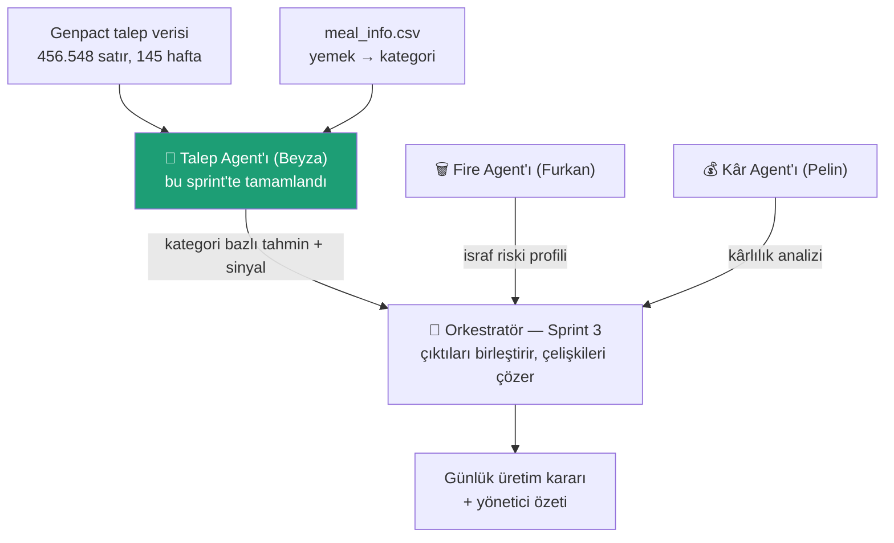
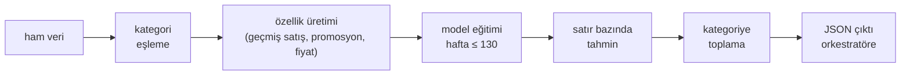

# Sprint 2 — Talep Agent'ı

**Takım:** The Parsimonia · **Proje:** WasteZero AI
**Sorumlu:** Beyza ATA (Product Owner)
**Kapsam:** Yalnızca Talep Agent'ı (Fire → Furkan, Kâr → Pelin, Orkestratör → Sprint 3)
**Durum:** ✅ Tamamlandı — model + kod + testler hazır, uçtan uca doğrulandı

---

## Özet (60 saniyede)

> Talep Agent'ı, *"gelecek hafta hangi kategoriden ne kadar sipariş gelir?"* sorusuna cevap veren makine öğrenmesi modelidir. Genpact gerçek talep verisiyle eğitildi. Basit tahmin yöntemine göre hatayı **%12.4'ten %7.6'ya** düşürdü. Kod, orkestratörün tek satırla çağırabileceği bir Python sınıfı olarak teslim edildi; 8 otomatik testle korunuyor.

| Ne | Sonuç |
|---|---|
| Tahmin hatası (kategori MAPE) | **%7.64** (naif yöntem: %12.40) |
| En iyi kategori | çorba %3.4 |
| En zor kategori | salata %13.9 (nedeni biliniyor: promosyon sıçramaları) |
| Test yöntemi | Zamana göre ayrım — model, test haftalarını **hiç görmedi** |
| Kod kalitesi | 8/8 otomatik test + temiz kurulum doğrulaması |

---

## 1. Bu agent ne işe yarıyor?

WasteZero AI üç uzman agent'tan oluşuyor. Her agent tek bir soruya cevap verir; kararı **orkestratör** verir:



Talep Agent'ının cevapladığı soru: **"X haftasında her kategoriden kaç sipariş beklenmeli?"**
Cevabı 5 ortak kategori dilinde verir (`corba, ana_yemek, salata, tatli, icecek`) — böylece diğer iki agent'ın çıktısıyla doğrudan birleşebilir.

---

## 2. Veri

| Dosya | İçerik | Rol |
|---|---|---|
| `data/raw/Food Demand Forecasting.csv` | 456.548 satır: hafta × merkez × yemek, sipariş sayısı, fiyat, promosyon | Ana eğitim verisi (Genpact — **gerçek** şirket verisi) |
| `data/raw/meal_info.csv` | 51 yemek: `meal_id → kategori + mutfak` | Kategori bilgisi (bu sprint'te eklendi) |

**Neden meal_info gerekliydi?** Ana veride yemekler sadece kod (`meal_id=1885`) olarak vardı. "Kategori bazlı tahmin" görevi, kategori bilgisi olmadan yapılamazdı. Bu dosya aynı Kaggle veri setinin parçası ve `meal_id` üzerinden birebir birleşiyor.

**Kategori eşlemesi (14 → 5):** Genpact'in 14 kategorisi, projenin ortak diline şöyle çevrildi:

| Genpact | Ortak kategori |
|---|---|
| Soup | corba |
| Salad | salata |
| Desert | tatli |
| Beverages | icecek |
| Biryani, Rice Bowl, Pizza, Pasta, Sandwich, Seafood, Fish, Starters, Extras, Other Snacks | ana_yemek |

---

## 3. Nasıl çalışıyor?



1. **Özellikler:** modelin kullandığı ipuçları — geçen haftaki satış (`lag1`), 2 ve 4 hafta öncesi, son 4 hafta ortalaması, fiyat, indirim oranı, promosyon bilgileri. Hepsi tahmin anında **bilinebilir** şeyler (promosyonlar önceden planlanır) → geleceği kopya çekmek yok.
2. **Model:** `HistGradientBoostingRegressor` (scikit-learn), **Poisson kaybı** ile — sipariş bir "sayım" verisidir, Poisson bu tip veriye kare-hatadan daha iyi uyar.
3. **Püf noktası:** Model **satır seviyesinde** (hafta × merkez × yemek) eğitilir, tahminler sonra kategoriye toplanır. Doğrudan kategori seviyesinde eğitmeyi denedik — veri 693 satıra düşüyor ve model basit tahmini bile geçemiyordu. Satır seviyesinde 442.174 örnekten öğreniyor.

---

## 4. Sonuçları nasıl ölçtük? (yöntem — jüri sorarsa)

- **Zamana göre ayrım:** eğitim = hafta 1–130, test = hafta 131–145. Model test haftalarını **hiç görmedi.** (Rastgele ayrım zaman serisinde "geleceği geçmişe sızdırır" ve sahte başarı üretir — o yüzden kullanılmadı.)
- **Naif kıyas:** her modeli *"geçen hafta ne satıldıysa bu hafta da o satılır"* basit yöntemiyle karşılaştırdık. **Naifi geçemeyen model, model değildir.** İlk denememiz geçemedi ve çöpe gitti — bu karşılaştırma olmasaydı bunu hiç fark etmeyecektik.
- **Model seçimi doğrulama diliminde:** varyantlar arasından kazananı seçerken test kümesine bakılmadı; seçim ayrı bir doğrulama diliminde (hafta 116–130) yapıldı, test yalnızca raporlamada kullanıldı.

---

## 5. Sonuçlar

Kategori bazında MAPE (ortalama yüzde hata — düşük iyi), test dönemi (hafta 131–145):

| Kategori | Naif ("geçen hafta") | Model v1 | **Model v2 (final)** |
|---|---|---|---|
| **Genel** | %12.40 | %8.27 | **%7.64** |
| corba | %4.47 | %3.54 | **%3.41** |
| tatli | %20.09 | %9.27 | **%6.02** |
| icecek | %10.24 | %6.85 | %7.07 |
| ana_yemek | %9.51 | %7.72 | %7.80 |
| salata | %17.70 | %13.96 | %13.87 |

- v1 = ilk çalışan model (kare-hata) · v2 = Poisson kaybı + 6 promosyon özelliği (doğrulama diliminde seçildi)
- Model **her kategoride** naifi yeniyor; en büyük kazanım tatlıda (hata üçte bire indi).

**EDA'dan önemli bulgu:** promosyon, satışı **~3 katına** çıkarıyor (salata: 332 → 1030 ortalama sipariş). Çorba kategorisinde ise veri boyunca hiç **e-posta promosyonu** yapılmamış (yalnızca sınırlı sayıda anasayfa vitrini var — 12.675 satırın 478'i).

**Dürüst sınırlılık — salata:** Salatanın hatalı olduğu haftalar, test dönemindeki **yalnızca iki promosyon haftası** (140 ve 144). Yani salata hatası yapısal: nadir promosyon sıçramalarını az örnekten öğrenmek zorunda. Bu, sunumda saklanacak değil söylenecek bir şey — verimizi tanıyoruz.

---

## 6. Daha iyisini denedik — 7 deneyin kaydı

Modeli daha da iyileştirmek için 7 yön test edildi. Seçim her zaman doğrulama diliminde yapıldı:

| # | Deneme | Doğrulama MAPE | Karar |
|---|---|---|---|
| — | v2 (referans) | 8.12 | — |
| 1 | Poisson kaybı | ✅ | **v2'ye alındı** |
| 2 | Promosyon özellikleri (6 adet) | ✅ | **v2'ye alındı** (Poisson ile birlikte 7.85) |
| 3 | Merkez bilgisi (`fulfilment_center_info.csv`) | 8.23 | ❌ katkı yok — model merkezi zaten `center_id`'den öğreniyor |
| 4 | Yıllık mevsimsellik (sin/cos) | 7.85 | ❌ doğrulamada kazandı ama **testte kötüleşti** (8.31) → kazanç gürültüymüş |
| 5 | Uzun gecikmeler (lag8, roll8) | 7.93 | ❌ sınırda; kombinasyonda kötüleşti (9.06) |
| 6 | Hiperparametre (800 iterasyon, lr 0.04) | 8.23 | ❌ katkı yok |
| 7 | Topluluk ort. / log hedef | 8.31 / 10.31 | ❌ katkı yok |

**Sonuç:** v2, bu verinin taşıyabildiği sınıra yakın. Bu tablo "daha fazlasını denemedik" eleştirisinin cevabıdır.

> Deney 4'ün dersi ayrıca değerli: doğrulama ile test çelişirse, iyileşme gerçek değildir. Mevsimsellik doğrulamada +0.27 kazandırıyor gibi görünüp testte −0.67 kaybettirdi; bu yüzden alınmadı.

---

## 7. Kod nasıl kullanılır?

```bash
pip install -r requirements.txt
python -m src.talep_agent          # demo: hafta 140 tahmini yazdırır
python tests/test_talep_agent.py   # 8 testi çalıştırır
```

Orkestratör (veya herhangi bir kod) için:

```python
from src.talep_agent import TalepAgent

agent = TalepAgent()      # veri yerelden okunur; model dosyası varsa ~2 sn'de yüklenir,
                          # yoksa kendini eğitir (~20 sn) ve models/ altına kaydeder
agent.predict(140)
```

Dönen çıktı (orkestratör sözleşmesi):

```json
{
  "week": 140,
  "in_sample": false,
  "by_category": {"ana_yemek": 390543, "corba": 10420, "icecek": 243073,
                  "salata": 108850, "tatli": 13439},
  "signal": {"ana_yemek": "dusuk", "corba": "yuksek", "icecek": "dusuk",
             "salata": "yuksek", "tatli": "normal"}
}
```

- `by_category` → kategori bazlı tahmini sipariş adedi
- `signal` → tahminin geçmiş ortalamaya göre durumu (`yuksek / normal / dusuk`) — orkestratörün karar dili
- `in_sample: true` dönerse o hafta modelin eğitiminde görülmüştür (tahmin güvenilirliği daha düşük yorumlanmalı)
- Geçersiz hafta → anlaşılır hata: `hafta 999 veride yok (geçerli aralık: 5-145)`

---

## 8. Kalite güvencesi

**8 otomatik test** (`tests/test_talep_agent.py`), pytest gerekmeden çalışır:

| Test | Neyi korur |
|---|---|
| sözleşme | çıktı anahtarları doğru |
| beş kategori | tam 5 ortak kategori dönüyor |
| geçerli değerler | negatif talep yok, sinyaller tanımlı |
| in_sample bayrağı | eğitimde görülen hafta işaretleniyor |
| geçersiz hafta | anlaşılır hata mesajı |
| hafta listesi | sıralı ve geçerli aralıkta |
| **regresyon** | bilinen çıktı sessizce değişirse alarm |
| tekrarlanabilirlik | aynı girdi → aynı çıktı |

**Temiz kurulum doğrulaması:** Repo klonunu taklit eden boş bir klasörde (model dosyası olmadan) agent kendini eğitti, paketle **birebir aynı** sayıları üretti ve 8/8 test geçti. Yani takımdan biri repoyu klonlayıp çalıştırdığında aynı sonucu alacak.

---

## 9. Süreçte yaşananlar ve dersler (Retrospective girdisi)

1. **Doküman ile kod çelişiyordu.** `DATA_SOURCES.md` Genpact diyordu ama işlenmiş dosyada kategori yoktu; eksik `meal_info.csv` bulunup eklendi. *Ders: koda başlamadan kaynak dokümanı doğrula.*
2. **İlk model tasarımı çöpe gitti.** Kategori seviyesinde eğitilen model naif tahmini yenemedi (%15.9 vs %12.4). *Ders: her model basit bir kıyasla test edilmeli.*
3. **Model seçimi test kümesiyle yapılmamalı.** Kazanan hep doğrulama diliminde seçildi. Mevsimsellik denemesi bunun neden şart olduğunu kanıtladı (doğrulamada kazanıp testte kaybetti).
4. **"Var" denilen hata doğrulanmadan yazılmamalı.** Kategori kodlaması hakkında öngörülen bir hata test edilince asılsız çıktı; koda yanlış yorum girmedi.
5. **Colab `Ctrl+S` GitHub'a göndermiyor** — `File › Save a copy in GitHub` gerekiyor. GitHub CDN'i de yeni push'u birkaç dakika eski gösterebiliyor.

---

## 10. Teslim edilenler

| Dosya | Açıklama |
|---|---|
| `data/raw/meal_info.csv` | Kategori eşlemesi (✅ push edildi — 10 Tem) |
| `notebooks/talep_agent.ipynb` | Araştırma kaydı: EDA + v1 model + grafikler (✅ push edildi — 10 Tem) |
| `src/talep_agent.py` | **Agent modülü (v2)** — orkestratörün çağıracağı sınıf |
| `src/__init__.py` | Paket tanımı |
| `models/talep_agent.joblib` | Eğitilmiş v2 modeli (1.8 MB) — yoksa agent kendini eğitir |
| `tests/test_talep_agent.py` | 8 otomatik test |
| `docs/sprint-2/SPRINT2_TALEP_AGENT.md` | Bu doküman |

> Not: Notebook, v1 araştırmasını o günkü sonuçlarıyla belgeler (geçerli bir tarihsel kayıt). v2 iyileştirmesi ve tüm deneyler bu dokümanda ve modülde yaşar.

---

## 11. Sonraki adımlar (Sprint 3'e köprü)

- Orkestratör, `TalepAgent().predict(week)` çıktısını Fire ve Kâr agent'larının kategori profilleriyle birleştirecek
- ~~`DATA_SOURCES.md`'ye `meal_info.csv` notu eklenecek~~ ✅ eklendi
- Opsiyonel ürün fikri: Genpact `test.csv` (hafta 146–155) ile "gerçek gelecek" tahmini — planlanan fiyat/promosyonla bir sonraki haftayı öngörme

---

*The Parsimonia — WasteZero AI · Sprint 2 · Talep Agent'ı · Beyza ATA*
